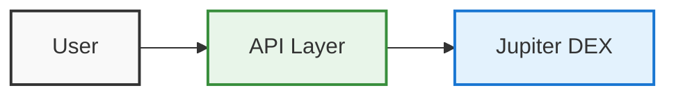

# ⚙️ Architecture Deep Dive

This page provides a technical overview of ApeNinja's architecture, designed to help developers understand how our system works.

## Core Components

ApeNinja's architecture consists of several key components that work together to provide a seamless trading experience across multiple blockchains:

<Grid>
  <Box>
    <h3>🧠 API Layer</h3>
    <p>Backend services that power our frontends and developer integrations</p>
  </Box>
</Grid>

## System Architecture

Here's a high-level overview of how the components interact:

```mermaid
flowchart LR
    User[User] --> Frontend[Frontend\nWeb/Telegram/Twitter/Extension]
    Frontend --> API[API Layer]
    API --> SuperAccount[SuperAccount]
    SuperAccount --> CoreTrading[CoreTrading]
    CoreTrading --> Strategy[Strategy Contracts]
    Strategy --> DEX[DEX/Protocol]
    
    style User fill:#f9f9f9,stroke:#333,stroke-width:2px
    style Frontend fill:#e1f5fe,stroke:#0288d1,stroke-width:2px
    style API fill:#e8f5e9,stroke:#388e3c,stroke-width:2px
    style SuperAccount fill:#fff3e0,stroke:#f57c00,stroke-width:2px
    style CoreTrading fill:#f3e5f5,stroke:#7b1fa2,stroke-width:2px
    style Strategy fill:#e3f2fd,stroke:#1976d2,stroke-width:2px
    style DEX fill:#fbe9e7,stroke:#d84315,stroke-width:2px
```



## Transaction Flow

When a user initiates a trade through one of our interfaces, the following sequence occurs:

<Steps>
  <Step title="User Request">
    User submits a trade request via one of our frontends (Web, Telegram, Twitter, Extension)
  </Step>
  
  <Step title="API Processing">
    Our API layer processes the request, calculating the optimal route and parameters
  </Step>
  
  <Step title="SuperAccount Execution">
    The user's SuperAccount receives and processes the transaction
  </Step>
  
  <Step title="CoreTrading Routing">
    The CoreTrading contract routes the transaction to the appropriate Strategy contract
  </Step>
  
  <Step title="Strategy Execution">
    The Strategy contract interacts with the target DEX or protocol to execute the trade
  </Step>
  
  <Step title="Confirmation">
    The transaction completes, and the results are returned to the user
  </Step>
</Steps>

## Component Details

### CoreTrading

The CoreTrading contract is the central router for all transactions in the ApeNinja ecosystem. It:

- Validates incoming transactions
- Routes calls to the appropriate Strategy contract
- Handles token transfers and approvals
- Manages security controls

<CodeGroup>
  ```solidity Interface
  interface ICoreTrading {
      function executeTrade(
          address tokenIn,
          address tokenOut,
          uint256 amountIn,
          uint256 poolId
      ) external returns (uint256 amountOut);
      
      function executeTradeWithRecipient(
          address tokenIn,
          address tokenOut,
          uint256 amountIn,
          uint256 poolId,
          address recipient
      ) external returns (uint256 amountOut);
      
      // Other functions...
  }
  ```
</CodeGroup>

### Strategy Contracts

Strategy contracts implement specific trading logic for different DEXs and protocols. Each strategy is assigned a unique pool ID:

| Pool ID | Strategy |
| --- | --- |
| `0` | Aggregator (e.g. Paraswap, Odos) |
| `1` | Uniswap V2 |
| `2` | Sushi |
| `3` | Yield Vaults |
| `4` | NFT Marketplaces (e.g. OpenSea) |

This pool ID system allows us to easily add new integrations without changing the core architecture.

<CodeGroup>
  ```solidity Interface
  interface IStrategy {
      function execute(
          address tokenIn,
          address tokenOut,
          uint256 amountIn,
          bytes calldata data
      ) external returns (uint256 amountOut);
      
      // Other functions specific to the strategy...
  }
  ```
</CodeGroup>

### SuperAccount

SuperAccount is a smart contract wallet deployed for each user on each chain. It provides:

- One-click trading (approval + swap in one transaction)
- Enhanced security features
- Custom trading strategies (Jeet/AntiJeet)
- Cross-chain capabilities

<CodeGroup>
  ```solidity Interface
  interface ISuperAccount {
      function executeTradeWithApproval(
          address tokenIn,
          address tokenOut,
          uint256 amountIn,
          uint256 poolId
      ) external returns (uint256 amountOut);
      
      // Other functions...
  }
  ```
</CodeGroup>

### API Layer

Our API layer is built with:

- Node.js backend services
- MongoDB for data storage
- Redis for caching
- WebSockets for real-time updates

It handles:
- User authentication and management
- Transaction preparation and routing
- Price and market data aggregation
- Notification services

## Solana Integration

Unlike EVM chains, our Solana integration works differently:

- No SuperAccount deployment needed
- Direct integration with Jupiter DEX
- API-based execution model



## Developer Resources

If you're looking to integrate with ApeNinja or build on top of our platform:

<CardGroup cols={2}>
  <Card title="API Reference" icon="code" href="/api-reference/introduction">
    Comprehensive documentation of our API endpoints
  </Card>
  <Card title="SDK Documentation" icon="book" href="/developers/sdk">
    Guides for using our JavaScript and Python SDKs
  </Card>
  <Card title="Contract Addresses" icon="file-contract" href="/technical/contracts">
    Deployed contract addresses for all supported chains
  </Card>
  <Card title="Example Code" icon="code-branch" href="/developers/examples">
    Sample code and integration examples
  </Card>
</CardGroup>
🧩 CoreTrading Contracts</h3>
    <p>Central routing contracts that handle trade execution logic</p>
  </Box>
  <Box>
    <h3>🧬 Strategy Contracts</h3>
    <p>Specialized contracts that integrate with specific DEXs and protocols</p>
  </Box>
  <Box>
    <h3>🔐 SuperAccounts</h3>
    <p>User-owned smart contract wallets that enable advanced trading features</p>
  </Box>
  <Box>
    <h3>